Mozilla Send

# 简介：

企业内网的网络优盘。

企业为了安全，禁止使用优盘，企业邮局附件又小，如何传输大文件呢？云盘不算好的选择，那群用户，啥都不删，不管多大，都给你塞满，那么Send将是你最好的选择。

Mozilla开源的send，可以按下载次数，保留时间，自动删除的网络存储空间。

# HTTPS SSL

虽然用起来挺方便，但是有一个缺点，仅支持https，也就是要加证书。公网的好办，这企业私网可不算好办。

所以这个目录，增加了一个生成证书的脚本，又和普通的一键生成自签名不太一样。我生成了CA中心证书，并生成了中间CA，使用x509签发服务器证书。

虽然还有一些问题，但是凑活能用了。

更完整的CA中心，请看[jackadam1981/OpenSSL_CA: OpenSSL implements CA servers. (github.com)](https://github.com/jackadam1981/OpenSSL_CA)未完结。

# 使用方法

## 生成证书

生成证书还没写交互式，改配置文件吧。

证书配置文件在cert_conf目录

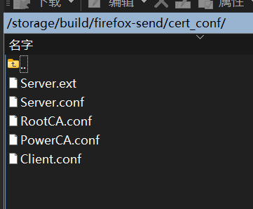

### 修改Servers.ext

看着挺多，其实我都抄好了，只需要配置Server.ext，配置下面的ip地址和域名。

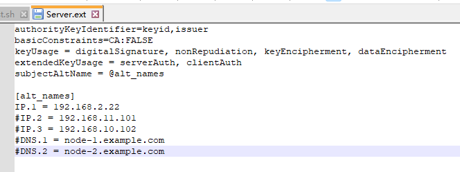

### 修改create_cert.sh

其实改的也就是注册信息，

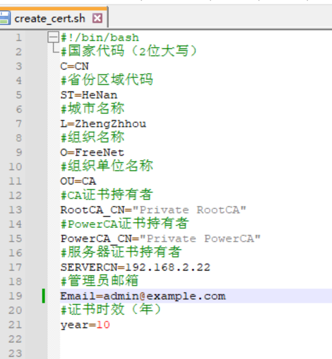

运行 create_cert.sh 简单的交互，输入y/n，就可以生成完整的所有证书了。

## 配置send

send也有一些需要配置的东西，如最大下载次数，最长保留时间，最大文件大小。

已修改最多下载100次，最大保存7天，可以上传5G文件，无特殊需求，可不修改。

### 最大保存时间

不知道和上面的expire_times_seconds有没有关系，但是我还是设置为上面列表中的值了。

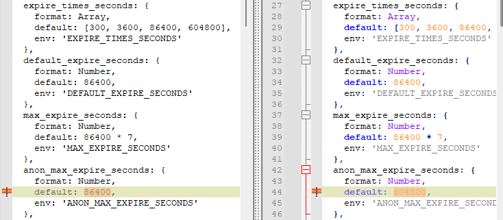

### 最大下载次数

不知道和上面的download_counts有没有关系，但是我还是设置为上面列表中的值了。

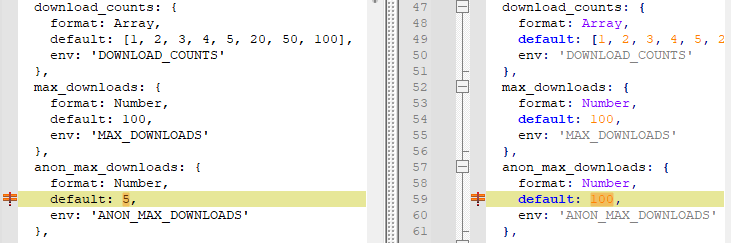

### 最大文件尺寸

看起来是设置两个，也不知道是啥意思，有可能anon是指匿名用户。

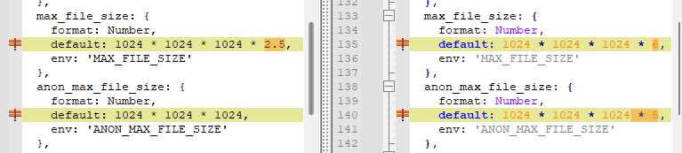

## 配置nginx

本来nginx做反向代理，是为了加SSL证书，现在脚本自动处理证书。无需配置证书相关。

需要配置docker-compose.yaml中的hostname，我实在不知道你的端口，暂无自动化脚本。

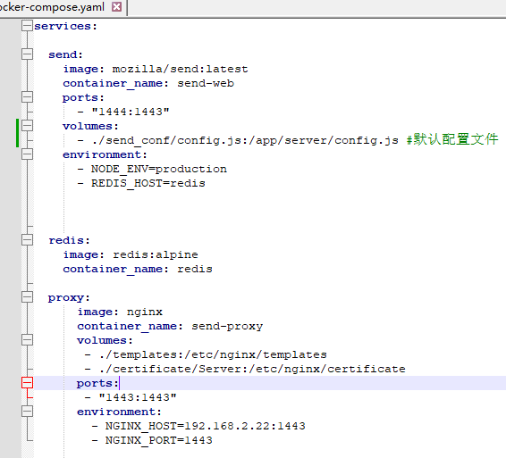

需要配置成你的访问地址，记得带上端口号。

稍微解释几句，send当中 ports：  1444：1443，是为了测试send是否正常的，生产使用可以删除这两行。

proxy  1443：1443，这里是配置你访问的端口1443，左边的，你也可以改成别的，同步要改nginx_host的端口。

如果你改右边的1443，则同步要改nginx_port。但是然并卵，你需要访问的端口是ports: 左边的，右边的是在容器中工作的不需要改。

## 启动运行

docker compose up -d

老样子，一行命令启动。

# 信任证书

虽然服务器有了证书，可以用https访问，每次还要提示，高级……还是有点烦啊。

生成证书时会自动生成PowerCA目录，下载PowerCAChain.p12证书文件。

到windows双击该文件，无脑下一步，重启浏览器。恼人的提示消失了。

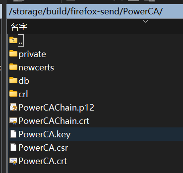

# 高级用法

我们已经有了一个可以在windows导入的证书文件。如果下一次再部署https的网站，难道每次在客户端导入证书么？

用已经导入的，再签发一个就好了。

修改Server.ext，其中允许的IP地址和域名。

修改create_cert.sh中的serverCN。

再次运行create_cert.sh，注意前面生成CA，PowerCA选n，不重复生成，只生成Server证书就好了。

新生成的Server证书将在certificate/Server目录，并以servercn命名。

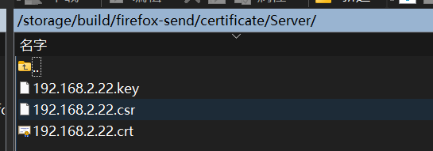

# 跑题了send用法

## 默认值

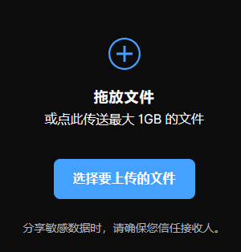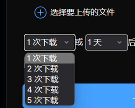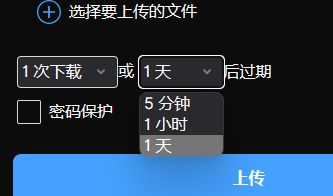

## 修改值

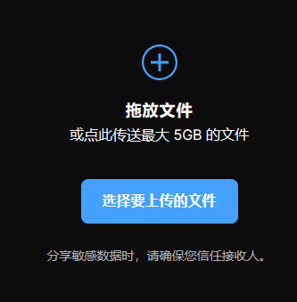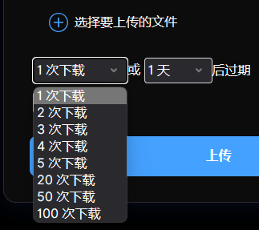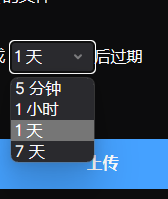

## 下载分享

根据提示，上传后会弹出下载链接，超过下载次数或存储时间后，就删了。

将这个分享链接发给同事就好了。

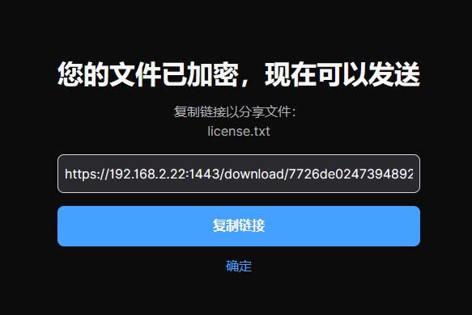
