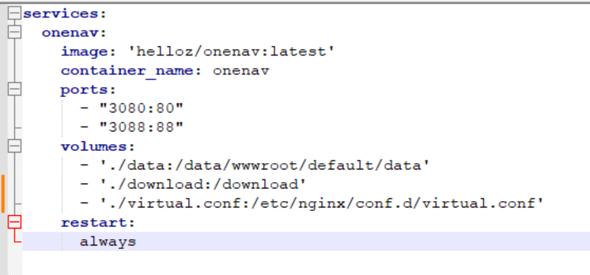
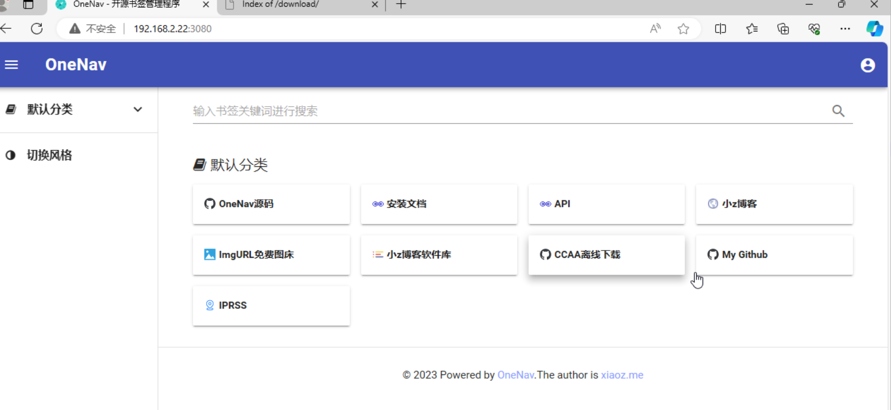
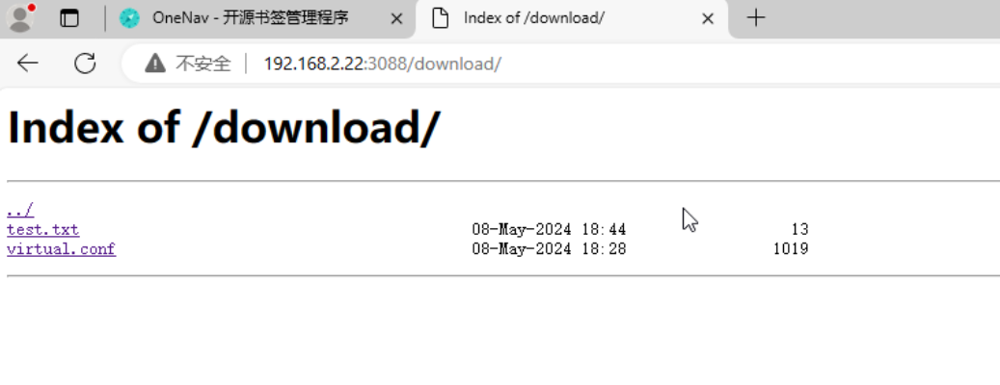

# 简介：

onenav的一个docker-composy.yaml

附带了一个兼容老IE的皮肤。

增加了一个下载目录。

# 使用方法：

80为onenav监听端口，3080为外部映射端口，直接访问3080即可进入onenav的安装向导，配置管理员账号与密码即可开始使用。

88端口为download下载目录监听端口，3088为外部映射端口，默认访问为http://ip:3088/download/,注意最后的/。

data目录为onenav持久化存储，包含数据库文件和兼容IE的皮肤。

download是目录浏览的主目录，需要下载的文件放入这里即可。

virtual.conf，是下载服务的配置文件，为节约资源，使用了onenav内置的nginx来服务。

由于不想改动onnav内部的nginx配置文件，另起文件，只好监听另一个端口了。

# onenav访问演示

# 目录下载演示

