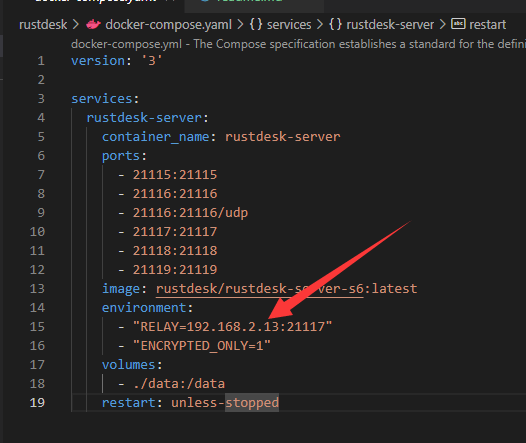
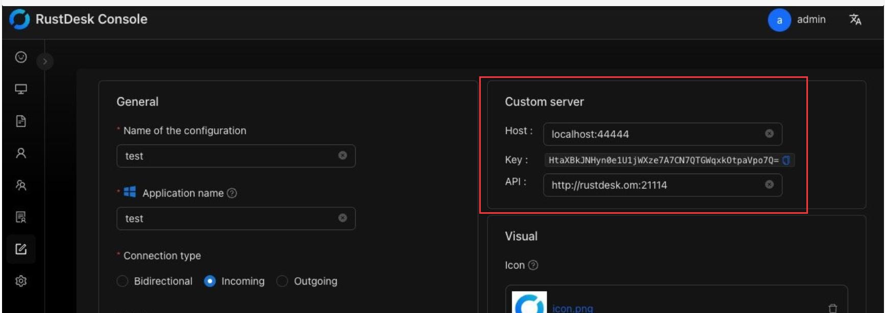
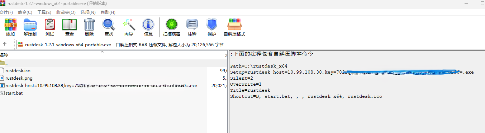
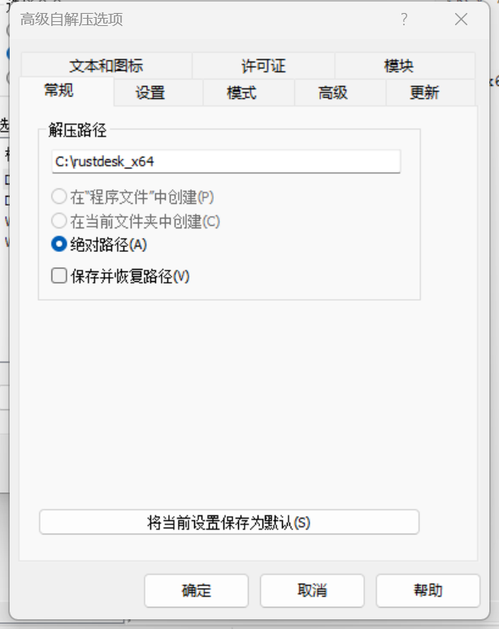
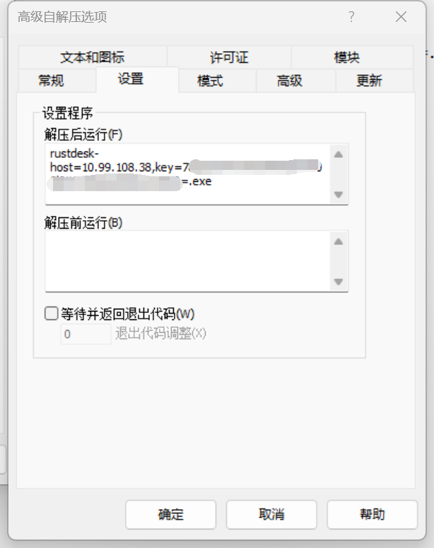
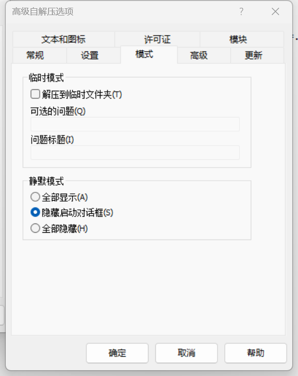
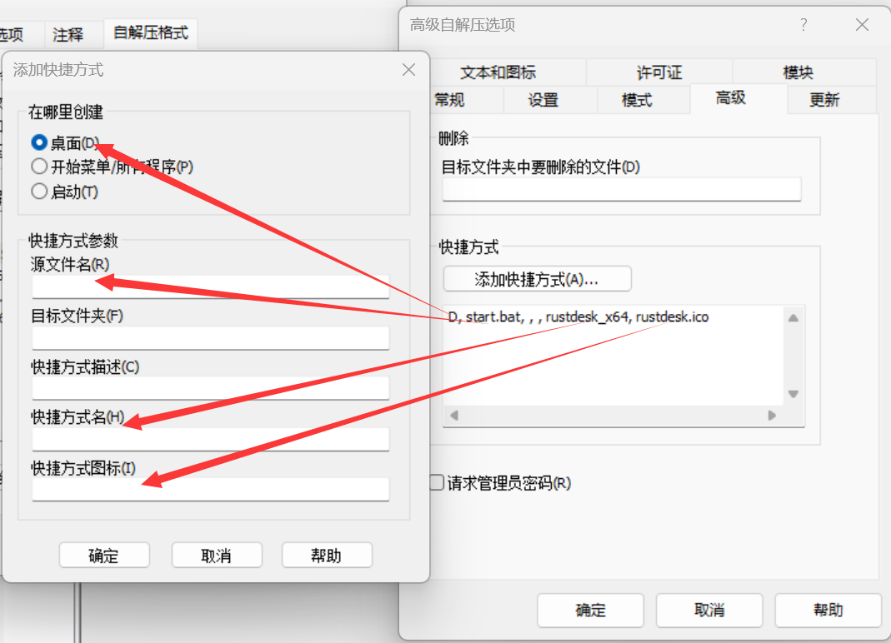
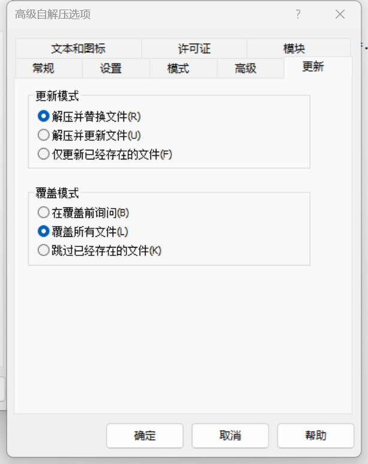
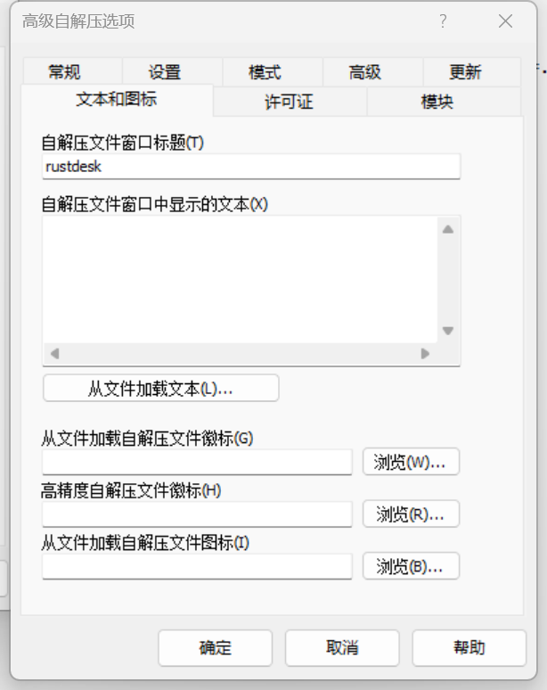

# 简介

rustdesk，一个开源免费的远程桌面管理系统。

虽然我没有配置好它的组策略防火墙。

也不耽误它好用啊。

# 安装

还是简单的一个docker-compose up -d 就起来了。

# 配置服务器

只要配置一下宿主机的IP地址就好了。这是最简单的版本。

# 配置客户端

这个就有点讲头了。

私有部署，那么就不是随便什么人都能连上来的，你知道IP，端口也不行。

服务器有秘钥，要客户端有公钥才能连接。这太麻烦了。将参数编译进可执行程序也麻烦。

[硬编码自定义设置 :: RustDesk文档](https://rustdesk.com/docs/zh-cn/self-host/client-configuration/hardcode-settings/)

好了，可以硬编码，就是改执行文件名来设置服务器地址和公钥。

先去找公钥吧，服务器启动以后，该目录下增加的data目录，里面找个  pub  结尾的文件，就是公钥。复制里面的字符串备用。

看我自己做的一个自解压包，文件名被改为了rustdesk-host=*****,key=******.exe

其实这个文件就可以了，但是文件名超长，我没有办法用rar为它创建桌面快捷方式。

所以只好做了个bat来启动这个超长文件名。

为bat做了桌面快捷方式，并提取了一个ico做快捷方式图标。

自解压到C:\rustdesk_x64。

自解压路径

自解压后运行，第一次解压就直接启动。

隐藏启动对话框

创建个桌面快捷方式

解压替换，覆盖所有文件。

窗口标题也改一下吧

当然，你也可以下载我提供的这个exe，只要改一下执行文件名，改一下bat里面的文件名，还有解压后运行的命令。

# 组策略防火墙

这个我没有配置成功，也去微软论坛问了问，没回应。

[域组策略高级防火墙设置中应用程序路径使用环境变量问题 - Microsoft Community](https://answers.microsoft.com/zh-hans/windows/forum/all/%E5%9F%9F%E7%BB%84%E7%AD%96%E7%95%A5%E9%AB%98/fbfa6ac8-1329-4d7d-acac-f318bb899825)

事情是这样的，我在域中开始使用rustdesk这个软件来进行远程协助、维修诊断工作。

这个软件是免安装的，但是它会在    c:\users\用户名\appdata\local\rustdesk\rustdesk.exe来运行  这个目录还会有其他的文件。

它使用随机端口，并通过中央服务器来进行协调分发。

我在域控创建了防火墙允许  %localappdata%\rustdesk\rustdesk.exe 所有都允许

但是用户端还是会弹出防火墙请求，请求的路径为 c:\users\用户名\appdata\local\rustdesk\rustdesk.exe

如果取消防火墙请求，则无法链接，并且自动创建两条拒绝的防火墙策略。

c:\users\用户名\appdata\local\rustdesk\rustdesk.exe    tcp允许

c:\users\用户名\appdata\local\rustdesk\rustdesk.exe    udp允许

我学着它的样子，分别创建tcp udp的策略

 %localappdata%\rustdesk\rustdesk.exe    tcp 允许

 %localappdata%\rustdesk\rustdesk.exe   udp允许

无效。

难道这里不能使用这个环境变量么?

我也尝试过另一种写法：

%homedrive%%homepath%\appdata\local\rustdesk\rustdesk.exe

组策略提示路径无效。
